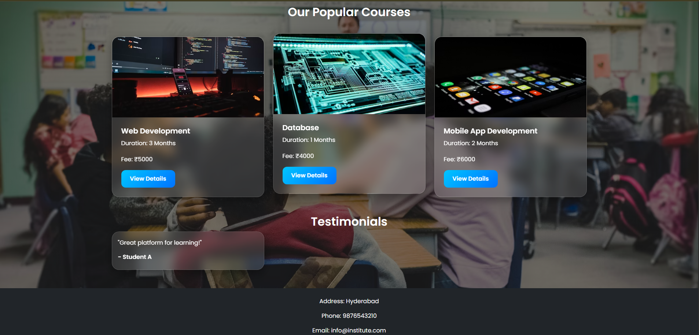

# 🎓 Online Course Registration Portal

A modern and aesthetic **Online Course Registration Portal** built using **HTML, CSS, Bootstrap, and JavaScript**.

The project provides students with an interactive platform to explore courses, learn about faculty members, contact the institute, and register online.

---

# Screenshots

#  Features

*  Responsive Home Page
*  Courses Section
*  Faculty Showcase
*  Contact Page
*  Student Registration Form
*  Modern Glassmorphism UI
*  Fully Responsive Design
*  Aesthetic Background Images
*  Bootstrap-Powered Components

---

#  Technologies Used

* HTML5
* CSS3
* Bootstrap 5

---

#  Repository Link

https://www.github.com/deekshitha-1701/Online-Course-Registration-Portal

---
